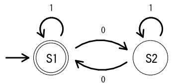

決定性有限オートマトンを実装する - データ族の使用例
===================================================

はじめに
--------

これは、データ族(Data Family)の簡潔な使用例だ。
型シノニム族ではなく、データ族を使うほうが自然な例として、
決定性有限オートマトン(Deterministic Finite Automaton, DFA)の
例が適していると考えた。
一番問題だったのは以下の点である。

* インスタンスの定義ごとに新しい型を定義する必然性

この例では、入力の型ごとに、「状態」を新たな型として定義する。
それぞれの入力ごとに専用の「状態」を定義するのは、自然なことと思われる。
よって、データ族の使用例として適切と考えた。

オートマトンとは
----------------

ざっくり言うと、つぎのようになる。
入力の列が「受理」されるかどうかをチェックする仮想的な機械。
入力の列があたえられると、内部の状態を変化させていき、
最後の入力が処理された段階で、
特定の状態になっているかどうかを調べ、
そうであれば、その入力列は受理されたということになる。

決定性有限オートマトンとは
--------------------------

有限個の状態と遷移動作の組み合わせから作られるオートマトン。
状態と入力によって、つぎの状態は、ひとつに決まる。

[Wikipedia: 決定性有限オートマトン](
	https://ja.wikipedia.org/wiki/%E6%B1%BA%E5%AE%9A%E6%80%A7%E6%9C%89%E9%99%90%E3%82%AA%E3%83%BC%E3%83%88%E3%83%9E%E3%83%88%E3%83%B3 )

入力されるものの、ひとつひとつを文字(alphabet)とよぶ。
ここで、0, 1のふたつからなる文字の列について、
0が偶数であれば受理する機械を考えよう。

